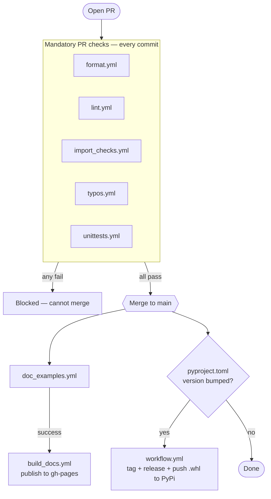

# Developing for PSEngine

In the guide below there is often the mention of "us" that means:

- Ernest Bartosevic
- Moise Medici

# Development Process

## Pre Requirements

* The minimum python version specified in the `pyproject.toml`
* Set environmental variable `RF_API_KEY` (PSEngine requirement), `RF_ASI_KEY` and `RF_SANDBOX_KEY` are also needed for ASI and Sandbox functionalities.
* Read the [Internals](https://recordedfuture-professionalservices.github.io/psengine/latest/modules/internals/) page
* A basic `pydantic` v2 knowledge (Some info in the Internals page)

## Code Requirements

To have your code merged there are some requirements your code must satisfy:

* Doing `pydantic` validation and adhering to the `psengine` standards (more on this in the Code standards section)
* Having properly documented public facing methods
* Having a good level of unit testing
* Having the public documentation written for the module added. If you are merging a feature, consider if the user needs to know about this feature, if yes add it to the public documentation
* Having the CHANGELOG updated. The CHANGELOG should be explanatory of what the change fix/feature is about and in context of a fix, what is fixing and in which circumstances.
* Having the ruff rules satisfied

There is an expectation that you are going to fulfil this requirements but we will help on any of these steps. Just ask :)

## Installation and Setup

Create a remote branch in the Github UI.

Download the repo:

```
git clone https://github.com/RecordedFuture-ProfessionalServices/psengine
```

Move to the repo folder `psengine`, move to your branch and pull your branch:

```
cd psengine
git checkout new_feature
git pull
```

Download `uv` if you don't have it already: <https://docs.astral.sh/uv/getting-started/installation/>.
Run `uv sync` which will create a virtual environment with Python 3.11 and all the standard, test and docs related dependencies.

A new environment with a different Python version can be created with `uv sync -p 3.13`. `uv` will download the interpreter if you don't have it already and install the dependencies.

### Dependency Management

All the dependencies are managed by `uv` via the `uv.lock` file. To add or remove a dependency use either `uv add` or `uv remove`:

```
uv add <depenedency>
uv add <dependency> --group [docs | dev ]
```

More information: <https://docs.astral.sh/uv/concepts/projects/dependencies/#adding-dependencies>

## Developing

### Module Structure Explained

All modules (there might be some rare exceptions) have the following structure:

```
psengine/new_feature
├── __init__.py
├── constants.py
├── errors.py
├── helpers.py
├── models.py
├── new_feature.py
└── new_feature_mgr.py
```

File explanation:

1. `__init__.py` → (Mandatory) expose the classes that are used by the enduser so the import can be done like

    ```python
    from psengine.analyst_note import AnalystNoteMgr
    ```
2. `constants.py` → (Optional) any static value that is needed inside one or more of your classes can be stored here. DO NOT store the endpoint url, this goes in `psengine/endpoints.py.`
3. `errors.py` → (Optional) any custom exceptions you want to raise. It is optional but recommended to raise custom exceptions for a better user experience and communicate a clear error scenario.
4. `helpers.py` → (Optional) any external function useful to the module but that do not is strictly related to the manager responsibilities. For example saving the attachment of a Analyst Note is a good candidate for this file.
5. `models.py` → (Optional) any Pydantic models that are not exposed to the end user can be stored here.
6. `new_feature.py` → (Mandatory) this file contains the ADT (abstract data type) and Pydantic models used by the user. (See Naming Convention for the difference in naming)
7. `new_feature_mgr.py` → (Mandatory) this file contains the interactions between the ADT and Pydantic models agains the API.

If any of the optional files is not used in your code, you can delete it.

### Validators

In `psengine.helpers.helpers.Validators` there are a few generic purpose validators:

* `convert_str_to_list`: from a string it converts it to list like: `[string]`. Example `"moise"` becomes `["moise"]`.
* `convert_relative_time`: converts a relative time like `8d` to ISO format date string.
* `check_uhash_prefix`: from a string or a list of strings, prepend `uhash:` to all the strings if not present. Example `"moise"` becomes `"uhash:moise"`.

This validators can be used as `AfterValidator` or `BeforeValidator` in any model for convenience. For example if a API expects a field with `uhash:abcd` we can add the `AfterValidator` of `check_uhash_prefix` so that the user doesn't need to remember to add the prefix when using psengine but the validator adds the prefix for us.

Example usage:

```python
class MalwareReportIn(RFBaseModel):
    """Validate data sent to the `/v1/reports` endpoint."""

    query: str
    sha256: str | None = None
    start_date: Annotated[
        str, BeforeValidator(Validators.convert_relative_time), AfterValidator(_split_time)
    ]
    end_date: Annotated[
        str | None,
        BeforeValidator(Validators.convert_relative_time),
        AfterValidator(_split_time),
    ]
    my_enterprise: bool
    limit: int = Field(ge=1, le=10)
```

### Code Standards

This section explains which standards and conventions we are adhering to.

#### Ruff

`ruff` (<https://docs.astral.sh/ruff/>) helps us with the majority of the code standards, you can run `ruff` with `make lint` and `make format`.

* `make format` will reformat your code and will always succeed unless there are syntax errors in your code
* `make lint` will run `make format` and the ruff linting rules. It will return all the errors found that `ruff` was not able to fix on its own:

    ```
    ❯ make lint
    psengine/classic_alerts/classic_alert.py:
      109:9 D102 Missing docstring in public method
      136:9 D102 Missing docstring in public method

    psengine_cli/constants.py:
      3:17 PTH118 `os.path.join()` should be replaced by `Path` with `/` operator
      3:30 PTH120 `os.path.dirname()` should be replaced by `Path.parent`
    ```

Adding `noqa` is not allowed except for special cases.

### Tests

Use `pytest` to test your code. If you know nothing about `pytest` let us know, we can help you set up your tests structure.
The standard `tests` folder structure is:

```
tests/new_feature
├── conftest.py
├── test_new_feature.py
└── test_new_feature_mgr.py
```

File explanation:

* `conftests.py` → store your fixtures in case they do not need to be used by other modules
* `test_new_feature.py` → tests for your models and ADTs
* `test_new_feature_mgr.py` → tests for your manager. If you have helpers functions, you can test them in this file or create a `test_helpers.py`, either ways is fine.

#### Donts

* Tests must not do live HTTP requests, use `mock`
* Use VCR. As a public repo we need to hide some of the information that we expose to the public as they are Recorded Future proprietary. Use mock and obfuscate the mock. See the Mock section below.
* Tests must not write in folders outside the `tests` dir. You can use the pytest fixture `tmp_path` if needed.
* Flaky tests
* Tests that are dependent on other tests, the Github Actions run tests in random orders.

### Mocks

Any mock file or data added as test, needs to be reviewed for sensitive data BEFORE any commit of such data.

In `tests/conftest.py` there are a few fixture that help the usage of mocks:

* `mock_request`: from a json file, it returns a `requests.Response` with content the content of the file
* `make_response`: from a dict returns a `reqeusts.Response` object
* `make_binary_response`: from binary returns a `reqeusts.Response` object
* `make_csv_response`: from a csv file or a csv-like string it returns a `reqeusts.Response` object with the csv as attachment

The way to use the above mockers is:

```python
def test_lookup(self, mgr, mock_request, mocker):
    mock = mock_request(MOCK_DIR / 'note_tQHD_j.json')
    mocker.patch.object(an_mgr.rf_client, 'request', return_value=mock)
    note = an_mgr.lookup('tQHD_j')
    assert isinstance(note, AnalystNote)
```

## Final Steps

### Formatting

Run a `make format` and `make lint` before running the Github actions and make sure there are no errors, else the GitHub actions will fail.

### Docstring

The docstring of public methods (example `search`), special methods (example `__str__`, `__init__`) are picked up and uploaded in <https://recordedfuture-professionalservices.github.io/psengine/latest/api/>. To make sure that the parsing is done properly some rules needs to be followed:

1. The `Annotated[Doc]` should be used for parameters and returns of public facing methods.
2. In public methods there should be a `Endpoints:` section to tell with endpoint is the function hitting. Example:

    ```
    Endpoint:
        `/analystnote/search`
    ```
3. Code should be defined in the following way:

    ````
    Example:

       ```python
         <code>
       ```
    ````

Please do not ignore any error from the Github action that publish the docs and if you are not sure how to fix them, let us know.

There are some known warnings from `psengine/config/config.py` and `modules/_includes/examples_warning.md`. All the others must be reviewed.

## Ready to merge?

Once ready to merge, open a merge request on GitHub, and add any of us as reviewers.

# Github Actions

These are the Github Actions configured:

| **Name** | **When Run** | **Mandatory in MR** | **Purpose** | **Fails If** |
| --- | --- | --- | --- | --- |
| `build_docs.yml` | If `doc_examples.yml` succeed. Runs when triggered by `docs_examples.yml`. | No | Run `mike` to build the documentation in the `gh-pages` repo. | There are unfixed errors in the documentation. |
| `doc_examples.yml` | On every merge to `main`. Runs automatically. | No | Run all the examples in `docs/examples` | At least one example script fails. With the exception of the files added to the `KNOWN_FAILS` array. |
| `format.yml` | Every commit after a MR is opened | Yes | Check that the code has been formatted with `ruff` and the rules specified in `ruff.toml` | Ruff formatting fails on at least one file. |
| `import_checks.yml` | Every commit after a MR is opened | Yes | Check that in `psengine` directory there are no imports like `from psengine.x import y` we want to stick to relative imports. Example `from ..x import y`, due to issues in Artifactory. | There is at least one occurrence of a wrong import. |
| `lint.yml` | Every commit after a MR is opened | Yes | Check that the code has been linted with `ruff` and the rules specified in `ruff.toml` | Ruff lint fails on at least one file. |
| `typos.yml` | Every commit after a MR is opened | Yes | Check with `typos-cli` that there are not typos in `psengine`, `docs` and the `README.md` | There is at least one typo found by `typos-cli` |
| `unittests.yml` | Every commit after a MR is opened | Yes | Check that there are no issues on all the supported versions of python. The tests results are written in the PR comment section and a link to the coverage file is attached. | The coverage falls below 94% in the overall project or at least one test in at least one python version fails. |
| `workflow.yml` | On every merge where the `pyproject.toml` version is increased. Run automatically. If the tagging and release is ok it build and push a `.whl` file to PyPi. Warning: do NOT change the name of the workflow. If you have to, schedule it with Paul Fothergill, to change it in the PyPi UI first. | No | Create a new release package and tag it with the latest version. It checks first if the new package has a different version compared to the current latest tag. If no, the rest of the action is skipped. | The tag and release part fails if there are `git` issues in the process, or `pyproject.toml` is not found. The PyPi if it gets renamed, or something in the permissions on PyPi has changed. |

There is a ruleset in Github that blocks from merging the pull request if not all the actions that run in the PR are not passing.

A graphical representation of the runs from a pull request that gets merged into `main`:



# Documentation

The documentation is build using `mkdocs` and `mike`. To test your documentation locally, do the following:

```
mkdocs serve
```

Alternatively you can run `mike serve` instead of `mkdocs serve` however I have been having issues in displaying the correct versions locally.

You will be able to access the documentation on `localhost:8000` both if you are using `mkdocs` or `mike`.

The `mkdocs` configuration and customisation is documented below:

| **Category** | **Attribute** | **Explanation** |
| --- | --- | --- |
| `markdown_extensions` | `admonition` | Adds styled note/admonition blocks like tips, warnings, and examples. |
| `markdown_extensions` | `attr_list` | Lets you add HTML attributes (like IDs or classes) directly in Markdown. |
| `markdown_extensions` | `markdown_include.include` (base_path: docs) | Enables including external Markdown files, using `docs` as the base directory. |
| `markdown_extensions` | `pymdownx.details` | Adds collapsible "details" blocks for expandable content sections. |
| `markdown_extensions` | `pymdownx.highlight` (`anchor_linenums`, `linenums`, `guess_lang`) | Enhances code block highlighting with line numbers and stable language detection. |
| `markdown_extensions` | `pymdownx.superfences` | Supports nested and custom fenced code blocks for advanced formatting. |
| `markdown_extensions` | `pymdownx.inlinehilite` | Enables inline code highlighting using special syntax. |
| `markdown_extensions` | `pymdownx.snippets (check_paths: true)` | Inserts external file snippets safely, verifying valid file paths. |
| `markdown_extensions` | `toc (permalink: true)` | Generates a table of contents with clickable permalinks for each heading. |
| `plugins` | `search` | Adds full-text search functionality to your documentation site. |
| `plugins` | `mkdocstrings` | Automatically generates documentation from source code docstrings. |
| `mkdocstrings.handlers.python.paths` | `["psengine"]` | Specifies the Python module(s) from which to extract documentation. |
| `mkdocstrings.handlers.python.options.docstring_options.ignore_init_summary` | `true` | Excludes `__init__` summaries from class docstrings. |
| `mkdocstrings.handlers.python.options.merge_init_into_class` | `true` | Merges constructor documentation into the class description. |
| `mkdocstrings.handlers.python.options.extensions` | `griffe_typingdoc` | Improves type hint rendering using the `griffe_typingdoc` extension. |
| `mkdocstrings.handlers.python.options.show_root_heading` | `true` | Displays a heading for the top-level module or class. |
| `mkdocstrings.handlers.python.options.show_if_no_docstring` | `true` | Shows entries even when no docstring is present. |
| `mkdocstrings.handlers.python.options.show_signature_annotations` | `true` | Displays type annotations in function/method signatures. |
| `mkdocstrings.handlers.python.options.inherited_members` | `true` | Includes members inherited from parent classes. |
| `mkdocstrings.handlers.python.options.separate_signature` | `true` | Places function signatures on their own lines for readability. |
| `mkdocstrings.handlers.python.options.unwrap_annotated` | `true` | Removes `Annotated[]` wrappers from type hints for cleaner output. |
| `mkdocstrings.handlers.python.options.docstring_section_style` | `spacy` | Formats docstring sections in a compact, spaCy-style layout. |
| `mkdocstrings.handlers.python.options.signature_crossrefs` | `true` | Turns type names in signatures into clickable cross-references. |
| `mkdocstrings.handlers.python.options.show_symbol_type_heading` | `true` | Displays headings for symbol types (like Classes, Functions, etc.). |
| `mkdocstrings.handlers.python.options.show_symbol_type_toc` | `true` | Adds symbol type categories to the table of contents. |

The files that are picked up during build are all defined in the `nav` section of the `mkdocs.yml` file. The `docs/examples` directory is excluded.

The files under `docs/modules` are standard markdown files, while those under `docs/api` are markdown with a specific syntax of mkdocs. For example:

```
::: psengine.enrich.lookup_mgr.LookupMgr
    options:
        members:
            - lookup
            - lookup_bulk
```

The first line is making `mkdocs` to import `psengine.enrich.lookup_mgr.LookupMgr`.

By default `mkdocs` would document all the public methods and the special methods. However, from the `options.members` list we are only specifying the `lookup` and `lookup_bulk` methods. This is done to avoid documenting the `__init__` which is already documented at the top of the page.

The same can be done for variables only:

```
::: psengine.enrich.constants
    options:
       members:
           - SOAR_POST_ROWS
           - ALLOWED_ENTITIES
           - ENTITY_FIELDS
           - MALWARE_FIELDS
```

This is importing from `constants` only the variables that we think make sense to show the users.

If more than one module has to be documented in the same file, that can be done like this:

```
::: psengine.enrich.models.lookup
::: psengine.enrich.models.base_enriched_entity
```

### Documentation Version

The version of the documentation is managed by `mike`:

```
extra:
  version:
    provider: mike
```

Note that when developing locally, if you run the `mkdocs serve` command to see your changes, the version dropdown will not be shown.
`mike` is then executed in the Github Action.

With the current configuration, all the changes in documentation in patch releases are written in the minor release documentation. So the documentation for 2.3.1, 2.3.2, 2.3.3 etc are all in 2.3 without distinction. That make sense if we continue following the semver standard and keep the CHANGELOG up to date.
